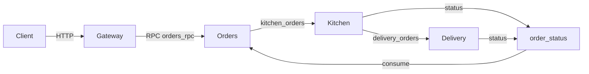

# Pizza Delivery Microservices

A small event-driven pizza delivery system built with four Python services that
communicate through RabbitMQ (AMQP). Each business service owns its own domain
logic and its own SQLite database.

The client talks to the **Gateway** over HTTP. The Gateway is an API layer
that calls backend services over RabbitMQ using synchronous RPC (request/reply
with a correlation id). Orders, Kitchen and Delivery exchange messages
asynchronously.

## Architecture



Service responsibilities:

| Service    | Role                                        | Storage                       |
|------------|---------------------------------------------|-------------------------------|
| `gateway`  | Thin HTTP API and AMQP RPC client           | none                          |
| `orders`   | Pricing, orders, status history, AMQP       | SQLite `orders_data` volume   |
| `kitchen`  | Recipes, ingredient stock, cooking          | SQLite `kitchen_data` volume  |
| `delivery` | Couriers, delivery assignment               | SQLite `delivery_data` volume |

The Gateway does not contain business logic and does not touch the database. It
only translates HTTP requests into RPC calls.

## Order lifecycle

1. The client calls `POST /order`. The Gateway sends an RPC request to the
   `orders_rpc` queue and waits for the reply.
2. Orders calculates the price (volume discount + delivery fee), stores the order
   with status `new`, publishes it to `kitchen_orders` and replies with the order.
3. Kitchen looks up the recipe, checks the ingredient stock and either rejects the
   order or cooks it. It reports `cooking` and `ready`, then sends the order to
   `delivery_orders`.
4. Delivery picks the least loaded free courier, reports `delivering`, then
   `delivered`.
5. Orders consumes status messages from `order_status` and appends them to the
   order history.

Statuses: `new` -> `cooking` -> `ready` -> `delivering` -> `delivered`.
A rejected order becomes `rejected`; if all couriers are busy an order can also
become `delivery_queued` (waiting for a free courier).

## Stack

* Python 3.12 + Flask
* Pika (RabbitMQ client, AMQP RPC)
* RabbitMQ 4.0
* SQLite (per-service storage)
* Docker Compose

## Project structure

```text
pizza-delivery/
├── docker-compose.yaml
├── gateway/
│   ├── app.py              # thin API, calls orders_rpc
│   └── rpc_client.py       # synchronous AMQP RPC client
├── orders/
│   ├── app.py              # orders_rpc and order_status consumer
│   ├── order_logic.py      # pricing logic
│   └── order_db.py         # menu, orders and status history
├── kitchen/
│   ├── app.py              # kitchen_orders consumer
│   ├── kitchen_logic.py    # cooking logic
│   └── kitchen_db.py       # recipes, ingredients, kitchen journal
├── delivery/
│   ├── app.py              # delivery_orders consumer
│   ├── delivery_logic.py   # courier assignment
│   └── delivery_db.py      # couriers and deliveries
├── tests/
└── requirements-test.txt
```

## Getting started

```bash
docker compose up --build
```

Endpoints and tools:

* Gateway API: http://localhost:5000
* RabbitMQ Management UI: http://localhost:15672

Create an order:

```bash
curl -X POST http://localhost:5000/order \
  -H "Content-Type: application/json" \
  -d '{"pizza": "Pepperoni", "address": "1 Main Street", "quantity": 2}'
```

Check the order and its status history:

```bash
curl http://localhost:5000/orders/1
curl http://localhost:5000/orders/1/history
```

Follow the logs:

```bash
docker compose logs -f
```

Stop and remove the data volumes:

```bash
docker compose down -v
```

## API

The Gateway exposes the public API on port 5000 and forwards it over AMQP RPC to
the Orders service (`orders_rpc` queue).

| Method | Path                    | Description                       |
|--------|-------------------------|-----------------------------------|
| GET    | `/menu`                 | pizza menu and prices             |
| POST   | `/order`                | create an order                   |
| GET    | `/orders`               | list all orders                   |
| GET    | `/orders/<id>`          | one order with status and courier |
| GET    | `/orders/<id>/history`  | full status history of an order   |

### POST /order

Request fields:

| Field      | Type   | Required | Notes                              |
|------------|--------|----------|------------------------------------|
| `pizza`    | string | yes      | menu code or name, case-insensitive |
| `address`  | string | yes      | delivery address                   |
| `quantity` | int    | no       | defaults to 1                      |

Example response (`202 Accepted`):

```json
{
  "pizza": "pepperoni",
  "pizza_name": "Pepperoni",
  "quantity": 2,
  "unit_price": 550,
  "subtotal": 1100,
  "discount": 0,
  "delivery_price": 0,
  "total_price": 1100,
  "address": "1 Main Street",
  "order_id": 1
}
```

Errors:

* `400` — missing/unknown pizza, empty address or invalid quantity;
* `500` — the message broker is unavailable (order is stored with status
  `publish_failed`);
* `503` — no reply from the Orders service within the RPC timeout.

Pricing rules: 10% discount from 3 pizzas, delivery costs 100 and is free from
1000.

## Adding a new service

Because the Gateway calls services by queue name, adding a service means:

1. create a consumer for a new `*_rpc` queue (a new `action` handler);
2. add one route in the Gateway that calls that queue.

## Data

Data is kept in named Docker volumes, so it survives restarts:

* `orders_data` — `menu`, `orders`, `order_status_history`;
* `kitchen_data` — `recipes`, `ingredients`, `recipe_ingredients`,
  `kitchen_orders`;
* `delivery_data` — `couriers`, `deliveries`.

On start each service creates only the schema (`init_db`). Sample data (the menu,
recipes and stock, the initial couriers) is inserted by a separate idempotent
`seed()` call and only when the `SEED_DATA=1` environment variable is set. Docker
Compose enables it for the demo; remove the variable to run with empty tables.

## Tests

Unit tests run without RabbitMQ. They use temporary SQLite databases and never
touch real data. The Gateway tests stub the RPC client, so no real services are
needed.

```bash
python3 -m venv .venv
source .venv/bin/activate
pip install -r requirements-test.txt
pytest tests -v
```

Coverage:

* `tests/test_gateway.py` — Gateway RPC forwarding and error handling;
* `tests/test_orders.py` — pricing, order storage and status history;
* `tests/test_kitchen.py` — cooking, stock consumption and rejections;
* `tests/test_delivery.py` — courier assignment, queueing and completion.

Integration tests talk to a real RabbitMQ broker. They are skipped when the broker
is unavailable. To run only those, start the broker (without the services, so they
do not consume the test messages) and run pytest:

```bash
docker compose up -d rabbitmq
pytest tests/test_amqp_integration.py -v
```

`tests/test_amqp_integration.py` covers the kitchen message flow and a full RPC
round-trip between the Gateway RPC client and the Orders handler over a real
broker.
